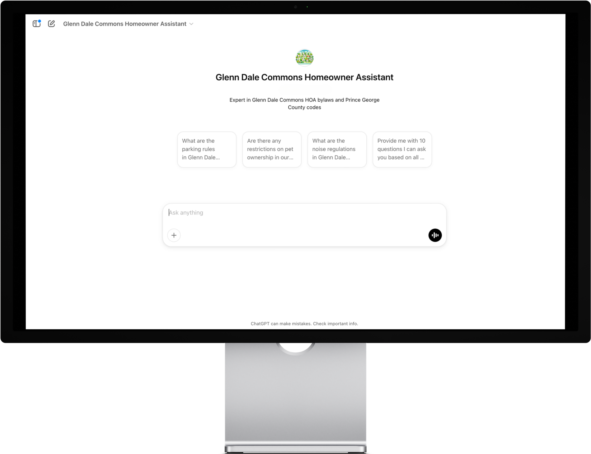

IMPORTANT NOTICE: This repository contains only mockups, documentation, and demonstration assets for the HOA Chatbot application. The actual source code is not publicly available. This repository is intended for showcase and demonstration purposes only.

# Glenn Dale Commons Homeowner Assistant

## Project Overview

A custom chatbot designed specifically for the Glenn Dale Commons Homeowner Association (HOA) to provide instant, accurate information to community residents. This assistant specializes in answering questions about HOA bylaws and Prince George County codes.

## Key Benefits

- **24/7 Information Access**: Homeowners can get answers to common questions anytime
- **Reduced Administrative Burden**: Decreases the volume of repetitive inquiries to HOA staff
- **Consistent Information Delivery**: Ensures all residents receive the same accurate information
- **Improved Resident Satisfaction**: Provides immediate responses to resident concerns

## Technology

This project utilizes:
- OpenAI Custom GPT platform
- Natural Language Processing (NLP)
- Advanced prompt engineering techniques

## Features

Check out the [FEATURES.md](FEATURES.md) file for a detailed breakdown of functionality.

## FAQ

Common questions about this project are answered in our [FAQ.md](FAQ.md) file.

## 📄 License
© [2025] Eric A. All Rights Reserved.
